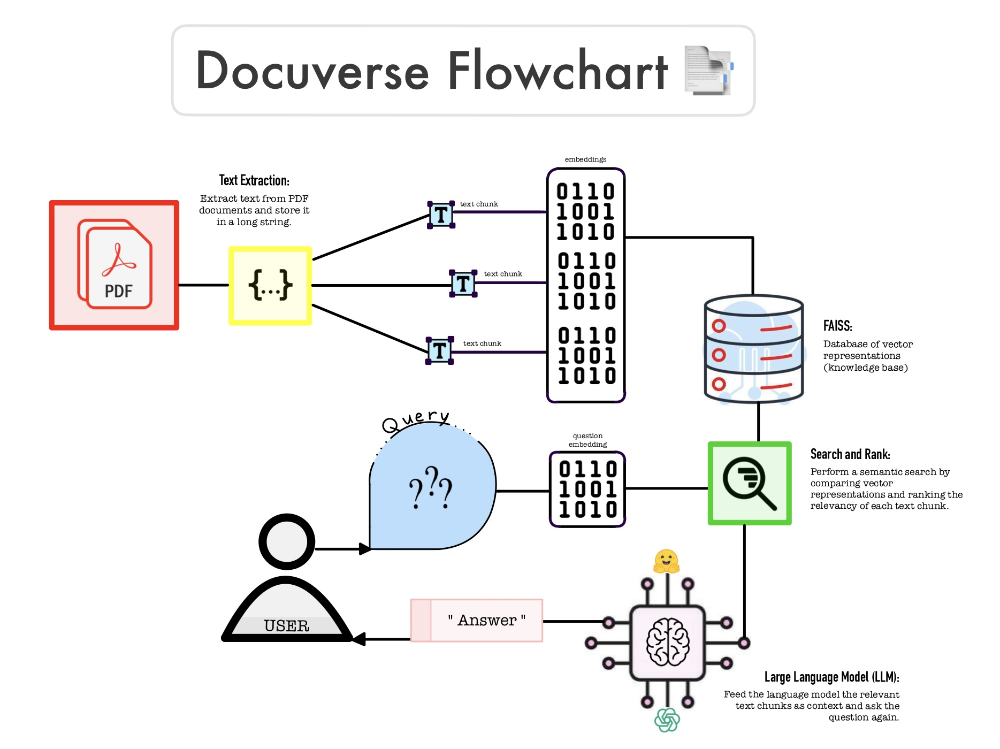

# docuverse
A streamlit document chatbot application using LLM from HuggingFace API

### Setup:
I'm using 64-bit Python v3.6.9
1. Clone this repository
   - git clone https://github.com/applepie7864/docuverse.git
2. Setup your python virtual environment
   - python -m venv your_environment_name
   - source your_environment_name/bin/activate
3. Install dependencies
   - pip3 install streamlit pypdf2 langchain python-dotenv faiss-cpu huggingface_hub InstructorEmbedding sentence_transformers watchdog
4. Create key file
   - Create a file named '.env'
   - Get your Huggingface inference key following this short tutorial: https://www.youtube.com/watch?v=jo_fTD2H4xA
   - Inside this file write: HUGGINGFACEHUB_API_TOKEN=your_token

### How it Works:

1. A user submits PDF Documents to be processed
2. Text inside the documents are extracted and stored in a large string
3. Create chunks of text by sectioning off the large string
4. Convert each chunk into embeddings using HuggingFace's instructor-xl algorithm. This allows us to represent the text as a list of numbers which provides semantics to the computer
5. Store embeddings into a FAISS database
6. User asks a question about the document
7. Embed the query using the same algorithm mentioned above
8. Search the database for vector representations similar to the query embeddings and retrieve ranked results for the most relevant text chunks
9. Feed the retrieved text chunks as context into a pre-trained language model along with the original question and output the answer back to the user